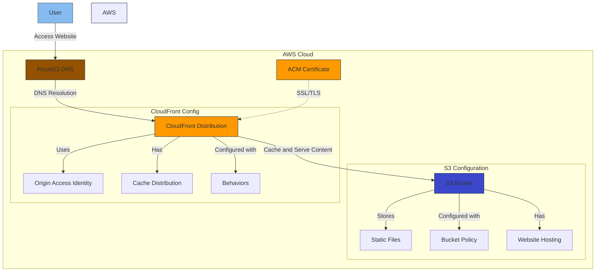

# AmongUs - Site estático no Amazon S3

                      ⠀⠀⠀⠀⠀⠀⠀⠀⠀⠀⠀⣠⣴⣶⣿⣿⣷⣶⣄⣀⣀⠀⠀⠀⠀⠀⠀⠀⠀⠀
                      ⠀⠀⠀⠀⠀⠀⠀⠀⠀⣰⣾⣿⣿⡿⢿⣿⣿⣿⣿⣿⣿⣷⣦⡀⠀⠀⠀⠀⠀
                      ⠀⠀⠀⠀⠀⠀⠀⢀⣾⣿⣿⡟⠁⣰⣿⣿⣿⡿⠿⠻⠿⣿⣿⣿⣿⣧⠀⠀⠀⠀
                      ⠀⠀⠀⠀⠀⠀⠀⣾⣿⣿⠏⠀⣴⣿⣿⣿⠉⠀⠀⠀⠀⠀⠈⢻⣿⣿⣇⠀⠀⠀
                      ⠀⠀⠀⠀⢀⣠⣼⣿⣿⣿⡏⠀⢠⣿⣿⣿⠇⠀⠀⠀⠀⠀⠀⠀⠈⣿⣿⣿⡀⠀⠀
                      ⠀⠀⠀⣰⣿⣿⣿⣿⣿⣿⡇⠀⢸⣿⣿⣿⡀⠀⠀⠀⠀⠀⠀⠀⠀⣿⣿⣿⡇⠀⠀
                      ⠀⠀⢰⣿⣿⡿⣿⣿⣿⣿⡇⠀⠘⣿⣿⣿⣧⠀⠀⠀⠀⠀⠀⢀⣸⣿⣿⣿⠁⠀⠀
                      ⠀⠀⣿⣿⣿⠁⣿⣿⣿⡇⠀⠀⠻⣿⣿⣿⣷⣶⣶⣶⣶⣶⣿⣿⣿⣿⠃⠀⠀⠀
                      ⠀⢰⣿⣿⡇⠀⣿⣿⣿⠀⠀⠀⠀⠈⠻⣿⣿⣿⣿⣿⣿⣿⣿⣿⠟⠁⠀⠀⠀⠀
                      ⠀⢸⣿⣿⡇⠀⣿⣿⣿⠀⠀⠀⠀⠀⠀⠀⠉⠛⠛⠛⠉⢉⣿⣿⠀⠀⠀⠀⠀⠀
                      ⠀⢸⣿⣿⣇⠀⣿⣿⣿⠀⠀⠀⠀⠀⢀⣤⣤⣤⡀⠀⠀⢸⣿⣿⣿⣷⣦⠀⠀⠀
                      ⠀⠀⢻⣿⣿⣶⣿⣿⣿⠀⠀⠀⠀⠀⠈⠻⣿⣿⣿⣦⡀⠀⠉⠉⠻⣿⣿⡇⠀⠀
                      ⠀⠀⠀⠛⠿⣿⣿⣿⣿⣷⣤⡀⠀⠀⠀⠀⠈⠹⣿⣿⣇⣀⠀⣠⣾⣿⣿⡇⠀⠀
                      ⠀⠀⠀⠀⠀⠀⠀⠹⣿⣿⣿⣿⣦⣤⣤⣤⣤⣾⣿⣿⣿⣿⣿⣿⣿⣿⡟⠀⠀⠀
                      ⠀⠀⠀⠀⠀⠀⠀⠀⠀⠉⠻⢿⣿⣿⣿⣿⣿⣿⠿⠋⠉⠛⠋⠉⠉⠁⠀⠀⠀⠀
Este projeto combina uma aplicação web divertida inspirada no Among Us com uma infraestrutura robusta na AWS usando Terraform. É um jogo da memória baseado no Amongus.

## Sobre a Aplicação

Uma interface web do jogo Among Us, completa com:
- Interface visual no estilo Among Us
- Efeitos sonoros do jogo
- Animações e transições entre câmeras
- Design responsivo

### Créditos

O código fonte da aplicação web (diretório `src`) foi desenvolvido originalmente por:
- [Código Fonte TV](https://www.youtube.com/user/codigofontetv)
- [Código Fonte Portal](https://codigofonte.tv/)

## Infraestrutura

A infraestrutura é totalmente gerenciada como código (IaC) usando Terraform e inclui:

- **S3**: Hospedagem do site estático
- **CloudFront**: CDN para distribuição global
- **Route53**: Gerenciamento de DNS
- **ACM**: Certificados SSL/TLS
- **GitHub Actions**: CI/CD para deploy automático

### Diagrama da Infraestrutura




# Arquitetura do Projeto Terraform S3 AmongUs

Este diagrama representa a arquitetura da infraestrutura AWS implementada através do Terraform. O fluxo de funcionamento é o seguinte:

1. O usuário acessa o website através do domínio configurado
2. O Route53 resolve o DNS para o CloudFront
3. O CloudFront serve o conteúdo do S3, utilizando cache quando possível
4. O certificado ACM garante a conexão HTTPS
5. O S3 armazena os arquivos estáticos do site

## Componentes Principais

- **Route53**: Gerenciamento de DNS
- **CloudFront**: CDN para distribuição de conteúdo
- **S3**: Armazenamento dos arquivos estáticos
- **ACM**: Gerenciamento de certificados SSL/TLS


## Deploy

O deploy é automatizado via GitHub Actions e inclui:
1. Sincronização com S3
2. Invalidação de cache no CloudFront
3. Configuração automática de credenciais AWS

### Pré-requisitos

Consulte o arquivo [PREREQ.md](PREREQ.md) para uma lista detalhada de todos os pré-requisitos e configurações necessárias.

### Configuração

1. Clone o repositório
2. Copie `terraform.tfvars.example` para `terraform.tfvars`
3. Configure as variáveis necessárias
4. Configure os secrets no GitHub:
   - `AWS_ACCESS_KEY_ID`
   - `AWS_SECRET_ACCESS_KEY`

### Comandos Terraform

```bash
# Inicializar o Terraform
terraform init

# Planejar as mudanças
terraform plan

# Aplicar as mudanças
terraform apply

# Destruir a infraestrutura
terraform destroy
```

## Estrutura do Projeto

```
.
├── src/                       # Código fonte da aplicação web
│   ├── audio/                 # Efeitos sonoros
│   ├── js/                    # JavaScript
│   ├── styles/                # CSS
│   └── svg/                   # Imagens vetoriais
├── .github/                   # Configurações do GitHub Actions
├── *.tf                       # Arquivos de configuração Terraform
└── terraform.tfvars.example   # Exemplo de variáveis
```

## Licença

Este projeto está sob a licença MIT. Veja o arquivo [LICENSE](LICENSE) para mais detalhes.

## Contribuição

Contribuições são sempre bem-vindas!
