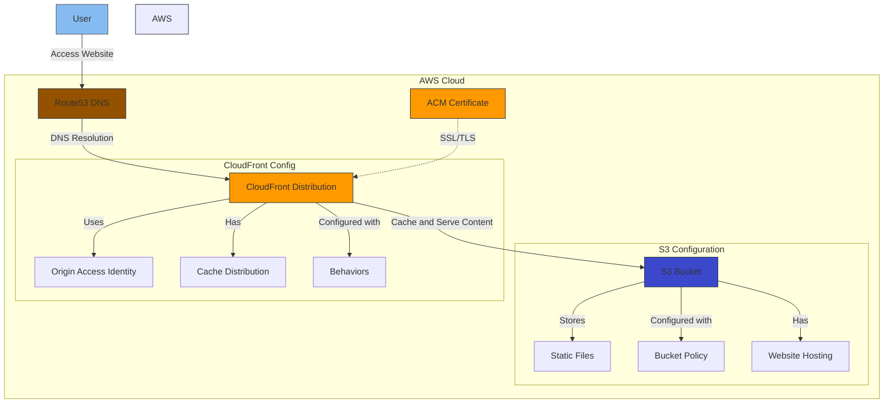

# Arquitetura do Projeto Terraform S3 AmongUs

Este diagrama representa a arquitetura da infraestrutura AWS implementada através do Terraform. O fluxo de funcionamento é o seguinte:

1. O usuário acessa o website através do domínio configurado
2. O Route53 resolve o DNS para o CloudFront
3. O CloudFront serve o conteúdo do S3, utilizando cache quando possível
4. O certificado ACM garante a conexão HTTPS
5. O S3 armazena os arquivos estáticos do site

## Componentes Principais

- **Route53**: Gerenciamento de DNS
- **CloudFront**: CDN para distribuição de conteúdo
- **S3**: Armazenamento dos arquivos estáticos
- **ACM**: Gerenciamento de certificados SSL/TLS
